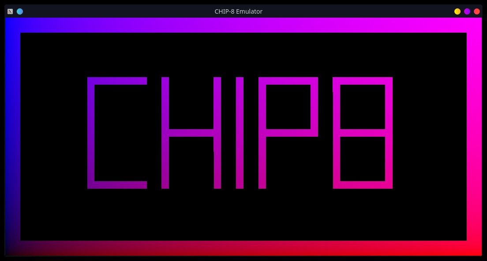

# c8rust

### Yet another CHIP-8 emulator in Rust

###### ...and this time, it's pointlessly complicated.

---



## Why?

Mainly as a learning exercise, both for learning Rust, and making myself familiar with it's gamedev-related libraries like `WGPU`. Therefore, rendering code is custom, and the rest of the codebase was also kept at as low-level as was reasonable.

Rendering code keeps the entire screen state in a packed u32 array uniform (1 bit per pixel), updates only the parts that were modified between frames (as much as possible, given a contiguous slice), and draws the grid entirely on the GPU, so it should be pretty snappy (and scales nicely as a bonus).

Sound was also implemented, though, as it wasn't my main focus, it's pretty bare-bones.

## Build

```shell
$ rustc --version
rustc 1.54.0 (a178d0322 2021-07-26)
$ cargo build
```

## Run

```shell
$ cargo run
```

Drag and drop ROM files onto the window to play them. Keys are mapped the following way:

```
Keyboard   Chip-8 Keypad
+-+-+-+-+    +-+-+-+-+
|1|2|3|4|    |1|2|3|C|
+-+-+-+-+    +-+-+-+-+
|Q|W|E|R|    |4|5|6|D|
+-+-+-+-+ => +-+-+-+-+
|A|S|D|F|    |7|8|9|E|
+-+-+-+-+    +-+-+-+-+
|Z|X|C|V|    |A|0|B|F|
+-+-+-+-+    +-+-+-+-+
```

There are also 4 keybindings for setting different emulation speeds:

```
+--+
|F1| - ~100 ticks/s
+--+
|F2| - ~250 ticks/s
+--+
|F3| - ~500 ticks/s
+--+
|F4| - ~1000 ticks/s
+--+
```

## Might be fun @TODO

- Switchable graphics resolution modes (64x64, 128x128)
- Some sort of screen deflickerer 👀
- Better timing code (allowing more than 1000 ticks per second)

## References
- [Chip 8 Technical Reference](http://devernay.free.fr/hacks/chip8/C8TECH10.HTM)
